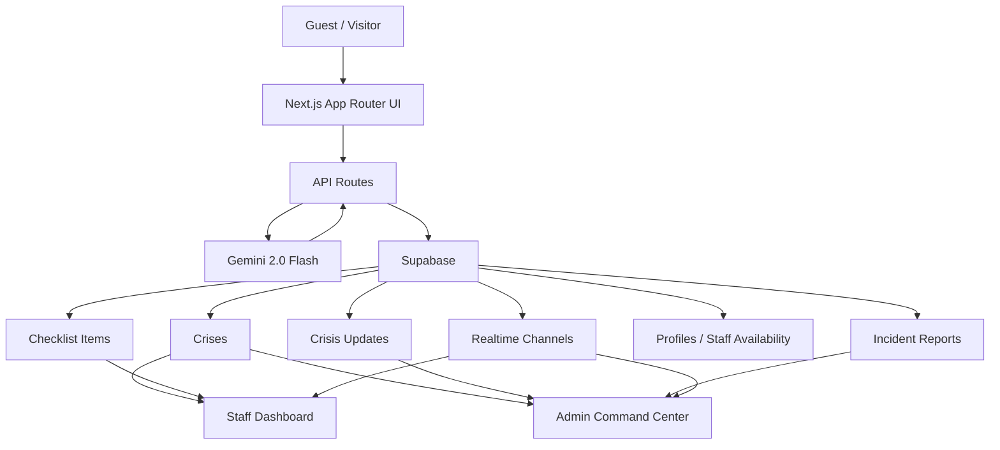
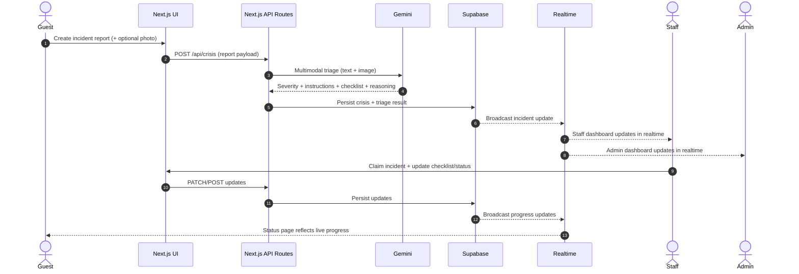
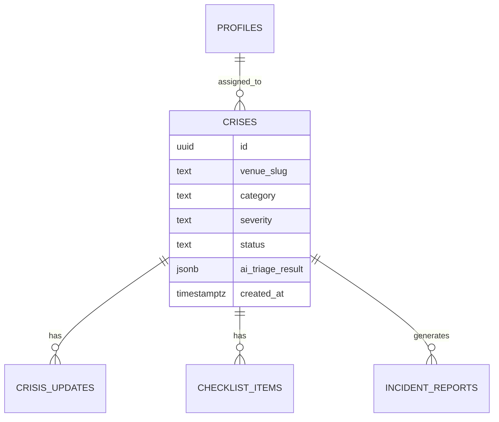

# CrisisSync

AI-native emergency coordination for hospitality venues.

CrisisSync helps hotels, resorts, and venue teams move from guest-reported incidents to coordinated staff response in seconds. It combines a guest-friendly reporting flow, realtime staff/admin dashboards, and Gemini-powered triage so operators can make faster, clearer decisions under pressure.

## Table of Contents

- [Why This Matters](#why-this-matters)
- [Key Features](#key-features)
- [Product Surfaces](#product-surfaces)
- [Architecture](#architecture)
- [Repository Structure](#repository-structure)
- [Tech Stack](#tech-stack)
- [Local Setup](#local-setup)
- [Supabase](#supabase)
- [Demo Runbook](#demo-runbook)
- [Scripts](#scripts)
- [Docs](#docs)

## Why This Matters

Hospitality incidents are chaotic for everyone involved:
- Guests do not know where to report or what details matter.
- Staff need immediate, structured response guidance.
- Managers need a live operational view, not fragmented updates.

CrisisSync turns that into one flow:
- Guest submits a report, optionally with photo evidence.
- Gemini analyzes the situation and produces severity, reasoning, instructions, and response protocol.
- Staff sees the incident instantly and can take ownership.
- Admin monitors, reassigns, and reviews AI-backed operational context.
- Incident closure generates structured post-incident reporting.

## Key Features

- Premium public experience with customer-facing website assistant
- Mobile-friendly guest crisis reporting flow
- Gemini multimodal triage using text plus optional photo evidence
- AI outputs with severity, reasoning, confidence, responder focus, and prevention insights
- Realtime staff dashboard for active response coordination
- Admin command center with analytics, staffing visibility, and incident detail
- Demo-safe fallback data so the product still presents well in a live hackathon environment

## Product Surfaces

- `/`
  Marketing landing page
- `/report`
  Guest reporting flow
- `/report/[id]/status`
  Guest status tracking
- `/login`
  Staff/admin sign-in and demo access
- `/staff/dashboard`
  Responder workspace
- `/admin/dashboard`
  Command center
- `/admin/analytics`
  Incident analytics

## AI Features

Gemini powers:
- Incident severity classification
- Category confirmation
- Guest safety instructions
- Staff response checklist
- Visual scene analysis from uploaded photos
- Confidence and reasoning output
- Responder focus guidance
- Prevention recommendations
- Post-incident report generation
- Customer-facing website concierge assistant

## Architecture



### Primary Flows

Guest → staff/admin coordination:



### Data Model (Conceptual)

This is the operational core the UI and realtime updates revolve around:



## Repository Structure

```text
.
├─ docs/                      # Demo + product docs (hackathon kit, runbook, SaaS direction)
├─ public/                    # Static assets
├─ src/
│  ├─ app/                    # Next.js App Router routes (UI + API)
│  │  ├─ api/                 # Server routes (Gemini, Supabase orchestration)
│  │  ├─ admin/               # Admin command center + analytics
│  │  ├─ staff/               # Staff responder dashboard
│  │  ├─ report/              # Guest reporting + status tracking
│  │  ├─ status/              # Health page (Supabase/Gemini/Groq)
│  │  └─ v/                   # Public venue entry (seeded demo slug lives here)
│  ├─ components/             # Shared UI building blocks
│  ├─ hooks/                  # Reusable React hooks
│  ├─ lib/                    # Supabase clients, AI helpers, demo data, utilities
│  ├─ types/                  # Shared TypeScript types
│  └─ middleware.ts           # Route protection + auth routing
├─ supabase/
│  ├─ migrations/             # Supabase migration history
│  └─ migration.sql           # Reference schema + policies snapshot
├─ .env.local.example         # Environment variable template (safe to commit)
├─ SETUP.md                   # Step-by-step setup + demo instructions
└─ package.json
```

## Tech Stack

- Next.js 14
- React 18
- TypeScript
- Tailwind CSS v4
- Framer Motion
- Supabase
- Google Gemini via `@google/generative-ai`
- Recharts

## Local Setup

1. Install dependencies:

```bash
npm install
```

2. Create `.env.local` with:

```bash
NEXT_PUBLIC_SUPABASE_URL=...
NEXT_PUBLIC_SUPABASE_ANON_KEY=...
SUPABASE_SERVICE_ROLE_KEY=...
GEMINI_API_KEY=...
GROQ_API_KEY=...
NEXT_PUBLIC_APP_URL=...
DEMO_SEED_SECRET=...
```

3. Run the app:

```bash
npm run dev
```

4. Open:

```bash
http://localhost:3000
```

## Supabase

Schema setup is in [`supabase/migrations/001_saas_schema.sql`](supabase/migrations/001_saas_schema.sql) (recommended) and a reference snapshot exists at [`supabase/migration.sql`](supabase/migration.sql).

The app includes demo-safe fallback data in [`src/lib/demo-data.ts`](src/lib/demo-data.ts), which helps keep dashboards and flows presentable even when the database is empty during a live demo.

## Demo Story

The strongest demo path is:

1. Open the landing page and explain the hospitality problem.
2. Show the customer-facing assistant.
3. Open `/v/grand-meridian` or scan the seeded QR path and submit a guest crisis report with optional photo evidence.
4. Let the app route to `/report/[id]/status` and highlight Gemini severity, instructions, and live progress.
5. Open the staff dashboard and take ownership of the incident.
6. Open the admin dashboard and show command-level visibility, retriage, and resolution.
7. Open the generated incident report and close on prevention insights.

## Demo Ops

Before any live demo:

1. Open `/status` and confirm Supabase + Gemini + Groq are online.
2. Seed the canonical demo venue with:

```bash
curl -X POST http://localhost:3000/api/demo/seed -H "x-demo-seed-secret: <DEMO_SEED_SECRET>"
```

3. Use the seeded public entry:

```text
/v/grand-meridian
```

4. Keep the golden flow limited to:

```text
/ -> /v/grand-meridian -> /report/[id]/status -> /staff/dashboard -> /admin/dashboard -> /admin/reports/[reportId]
```

If seeding is unavailable, the app still contains fallback demo-safe UI data for presentation, but the best judge experience is the seeded live flow above.

## What Makes This stand out!

- Clear real-world problem
- Strong end-to-end narrative
- Real AI utility, not decoration
- Realtime coordination story
- Premium UI polish
- Presentation-safe fallback behavior

## Scripts

```bash
npm run dev
npm run build
npm run start
npm run lint
```

## Demo Runbook

For a judge-friendly flow and recovery options if any dependency is flaky, see [`docs/demo-runbook.md`](docs/demo-runbook.md).

## Docs

- [`docs/hackathon-kit.md`](docs/hackathon-kit.md): pitches, demo script, judge talking points
- [`docs/demo-runbook.md`](docs/demo-runbook.md): pre-demo checklist, credentials, golden flow
- [`docs/saas-architecture.md`](docs/saas-architecture.md): suggested multi-tenant SaaS direction

## Status

Current state:
- Product redesign completed
- Gemini website assistant added
- Demo reliability pass completed
- Multimodal image triage completed
- AI reasoning and prevention insights completed
- Hackathon submission docs in progress
- some pages are not fully published yet, but all the main part is working


## Thankyou for checking this out, I truly Appreciate it.


no licences whatsoever, solo project, used gemini 3.1 pro heavily.
