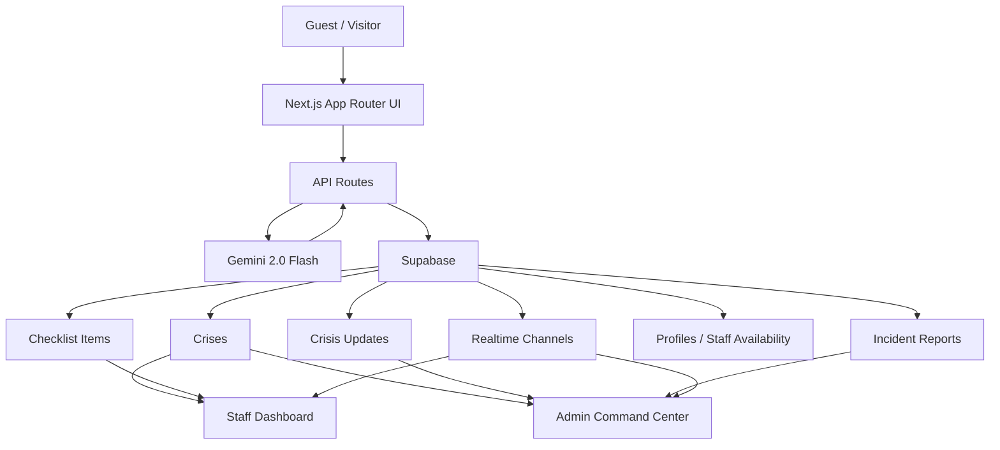

# CrisisSync

AI-native emergency coordination for hospitality venues.

CrisisSync helps hotels, resorts, and venue teams move from guest-reported incidents to coordinated staff response in seconds. It combines a guest-friendly reporting flow, realtime staff/admin dashboards, and Gemini-powered triage so operators can make faster, clearer decisions under pressure.

## Why This Matters

Hospitality incidents are chaotic for everyone involved:
- Guests do not know where to report or what details matter.
- Staff need immediate, structured response guidance.
- Managers need a live operational view, not fragmented updates.

CrisisSync turns that into one flow:
- Guest submits a report, optionally with photo evidence.
- Gemini analyzes the situation and produces severity, reasoning, instructions, and response protocol.
- Staff sees the incident instantly and can take ownership.
- Admin monitors, reassigns, and reviews AI-backed operational context.
- Incident closure generates structured post-incident reporting.

## Key Features

- Premium public experience with customer-facing website assistant
- Mobile-friendly guest crisis reporting flow
- Gemini multimodal triage using text plus optional photo evidence
- AI outputs with severity, reasoning, confidence, responder focus, and prevention insights
- Realtime staff dashboard for active response coordination
- Admin command center with analytics, staffing visibility, and incident detail
- Demo-safe fallback data so the product still presents well in a live hackathon environment

## Product Surfaces

- `/`
  Marketing landing page
- `/report`
  Guest reporting flow
- `/report/[id]/status`
  Guest status tracking
- `/login`
  Staff/admin sign-in and demo access
- `/staff/dashboard`
  Responder workspace
- `/admin/dashboard`
  Command center
- `/admin/analytics`
  Incident analytics

## AI Features

Gemini powers:
- Incident severity classification
- Category confirmation
- Guest safety instructions
- Staff response checklist
- Visual scene analysis from uploaded photos
- Confidence and reasoning output
- Responder focus guidance
- Prevention recommendations
- Post-incident report generation
- Customer-facing website concierge assistant

## Architecture



## Tech Stack

- Next.js 14
- React 18
- TypeScript
- Tailwind CSS v4
- Framer Motion
- Supabase
- Google Gemini via `@google/generative-ai`
- Recharts

## Local Setup

1. Install dependencies:

```bash
npm install
```

2. Create `.env.local` with:

```bash
NEXT_PUBLIC_SUPABASE_URL=...
NEXT_PUBLIC_SUPABASE_ANON_KEY=...
SUPABASE_SERVICE_ROLE_KEY=...
GEMINI_API_KEY=...
GROQ_API_KEY=...
NEXT_PUBLIC_APP_URL=...
DEMO_SEED_SECRET=...
```

3. Run the app:

```bash
npm run dev
```

4. Open:

```bash
http://localhost:3000
```

## Supabase

Schema setup is in [migration.sql](C:\Users\mssne\Desktop\Crisis_gdg\supabase\migration.sql).

The app includes demo-safe fallback data in [demo-data.ts](C:\Users\mssne\Desktop\Crisis_gdg\src\lib\demo-data.ts), which helps keep dashboards and flows presentable even when the database is empty during a live demo.

## Demo Story

The strongest demo path is:

1. Open the landing page and explain the hospitality problem.
2. Show the customer-facing assistant.
3. Open `/v/grand-meridian` or scan the seeded QR path and submit a guest crisis report with optional photo evidence.
4. Let the app route to `/report/[id]/status` and highlight Gemini severity, instructions, and live progress.
5. Open the staff dashboard and take ownership of the incident.
6. Open the admin dashboard and show command-level visibility, retriage, and resolution.
7. Open the generated incident report and close on prevention insights.

## Demo Ops

Before any live demo:

1. Open `/status` and confirm Supabase + Gemini + Groq are online.
2. Seed the canonical demo venue with:

```bash
curl -X POST http://localhost:3000/api/demo/seed -H "x-demo-seed-secret: <DEMO_SEED_SECRET>"
```

3. Use the seeded public entry:

```text
/v/grand-meridian
```

4. Keep the golden flow limited to:

```text
/ -> /v/grand-meridian -> /report/[id]/status -> /staff/dashboard -> /admin/dashboard -> /admin/reports/[reportId]
```

If seeding is unavailable, the app still contains fallback demo-safe UI data for presentation, but the best judge experience is the seeded live flow above.

## What Makes This a Strong Hackathon Project

- Clear real-world problem
- Strong end-to-end narrative
- Real AI utility, not decoration
- Realtime coordination story
- Premium UI polish
- Presentation-safe fallback behavior

## Scripts

```bash
npm run dev
npm run build
npm run start
npm run lint
```

## Status

Current state:
- Product redesign completed
- Gemini website assistant added
- Demo reliability pass completed
- Multimodal image triage completed
- AI reasoning and prevention insights completed
- Hackathon submission docs in progress
